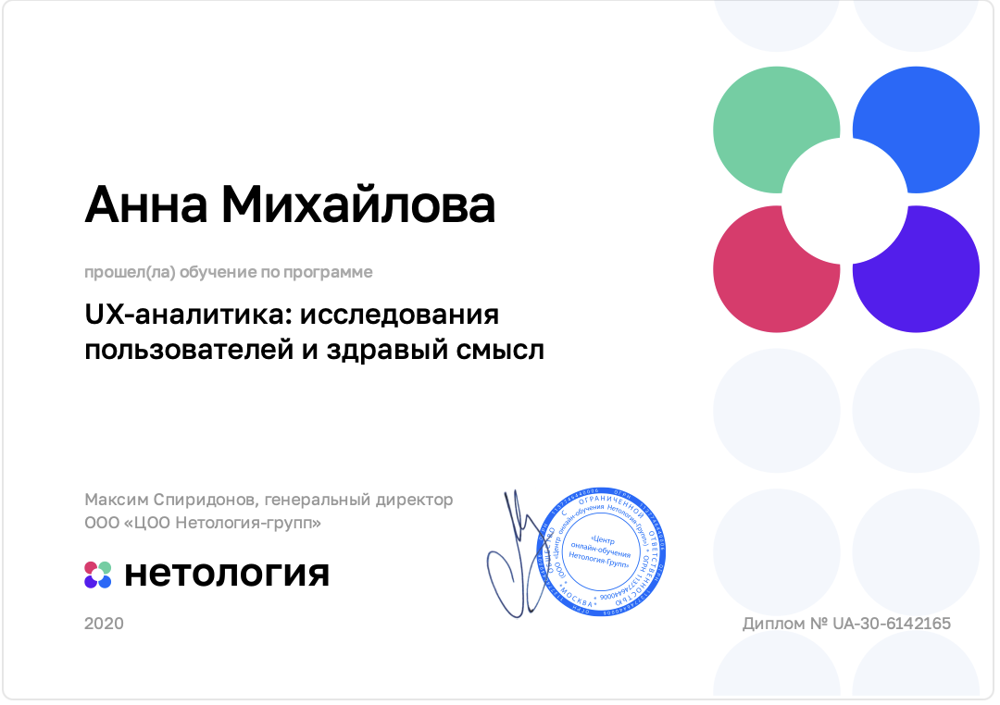

# Anna Mikhailova

Frontend Developer

*Veliky Novgorod, Russia*

## Contact

**e-mail:** petunova@gmail.com

**LinkedIn:** [www.linkedin.com/in/anna-mikhailova-dev](www.linkedin.com/in/anna-mikhailova-dev)

**GitHub:** [https://github.com/Farfique/](https://github.com/Farfique/)

## Summary

I think I’m the right candidate for you, if you’re looking for someone who:

- is absolutely capable of independent work and doesn’t need constant checking and surveillance;
- does care about her teammates and does her best not to let them down;
- is always eager to learn something new and, besides that, is learning fast;
- loves to immerse herself in the world of logic, dependencies and patterns;
- has seen projects and work processes from almost all perspectives: advertising and SMM, quality assurance, design, development and analytics.

You are my dream employer if you:

- work on an IT project in one of these domains: time-management, project-management, e-learning or e-health. I do consider jobs from other spheres, but this is where my heart is;
- don’t think stress is the best environment for productive teams;
- give your employees the freedom to decide which hours to work.

## Top skills

-  Javascript, ES6, Typescript
-  Vue.js, Vuex
-  HTML5, CSS3
-  Figma
-  SQL
-  Adobe Illustrator, Adobe After Effects

## Code example
~~Cannot reveal the title~~ kata solution on [codewars](https://www.codewars.com/):

``` javascript
function game(n) {
    return (Math.pow(n,2) % 2) ? [Math.pow(n,2), 2] : [Math.pow(n,2)/2];
}
```

## Experience
### MIR
#### Frontend Developer
##### November 2020 - June 2021 (8 months)

- Supported old features and developed new ones for a web-app with Vue.js framework (Vue 2, Vuex, Vue Router).
- Created and implemented new design (using Figma, Vue 2, Vuex, Javascript, ES6, HTML5, CSS).
- Participated in backend development (Java, Spring, Swagger, PostgreSQL).

### Astrosoft Development
#### QA Engineer
##### April 2013 - August 2017 (4 years 5 months)

- Performed a lot of manual tests, wrote test specs and test plans.
- Introduced GUI Test Automatization (C# + Selenium WebDriver) on a project with considerable legacy-coded part.
- Created a help utility on C# to construct Excel-report based on xml-files of test results.
- Added functionality to a device simulator (which sent mock responses to certain http-requests).
- In a team, introduced solution for integration testing (not using UI, but with creation of true test database) on C#.
- Covered an AngularJS + TypeScript project with Protractor + Jasmine GUI tests.
- Covered a Windows-app (C#) project with unit tests using xUnit.net

### JSC Novgorod Glass Fiber Plant 
#### Development manager
##### March 2011 - April 2013 (2 years 2 months)


- Organized participation in 2 industrial expos (Moscow and Shanghai), including design of all handouts, banners, order and decoration of stands, personal participation as an expert.
- Designed several advertisement blocks and articles for industrial magazines. Constructed English+French versions of a company's site on Joomla CMS (+ SEO).
- Conducted acceptance testing of a Russian version of site, ordered at web- studio.

## Education
### Basic education
#### Higher School of Economics
##### Master's degree, Applied Economics · (2004 - 2010)

#### Université Paris X Nanterre
##### Master's degree, Economie des Institutions · (2009 - 2010)

### Course certifications
#### React: Using Typescript
###### LinkedIn | *Issued Sep 2021*

#### Learning Typescript
###### LinkedIn | *Issued Sep 2021*

#### Responsive Web Design
###### freeCodeCamp | *Issued Apr 2021*
###### [See credential](https://www.freecodecamp.org/certification/farfique/responsive-web-design)

#### Web-designer
###### Netology | *Issued Apr 2020*

#### Mobile apps design
###### Netology | *Issued 2020*

#### UX-analytics
###### Netology | *Issued 2020*





## English
**B2** (Upper-Intermediate)

## Other languages
- French (Professional Working) 
- German (Limited Working) 
- Russian (Native or Bilingual)

